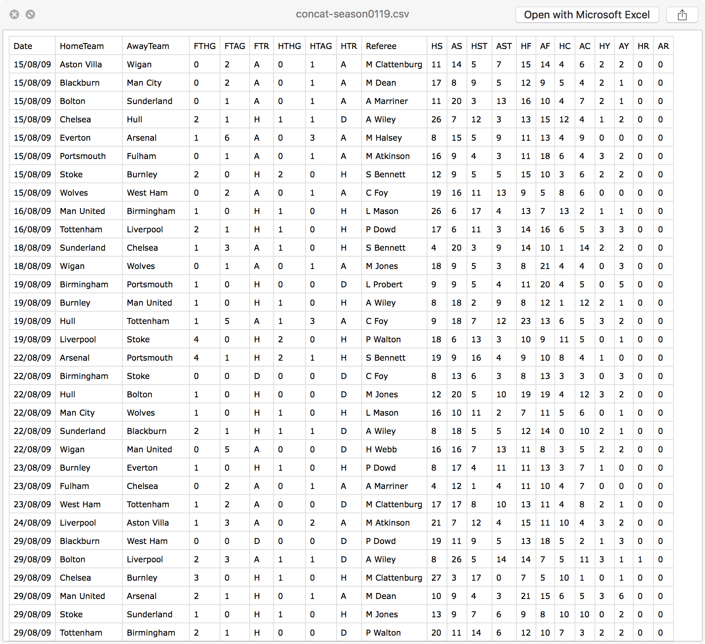
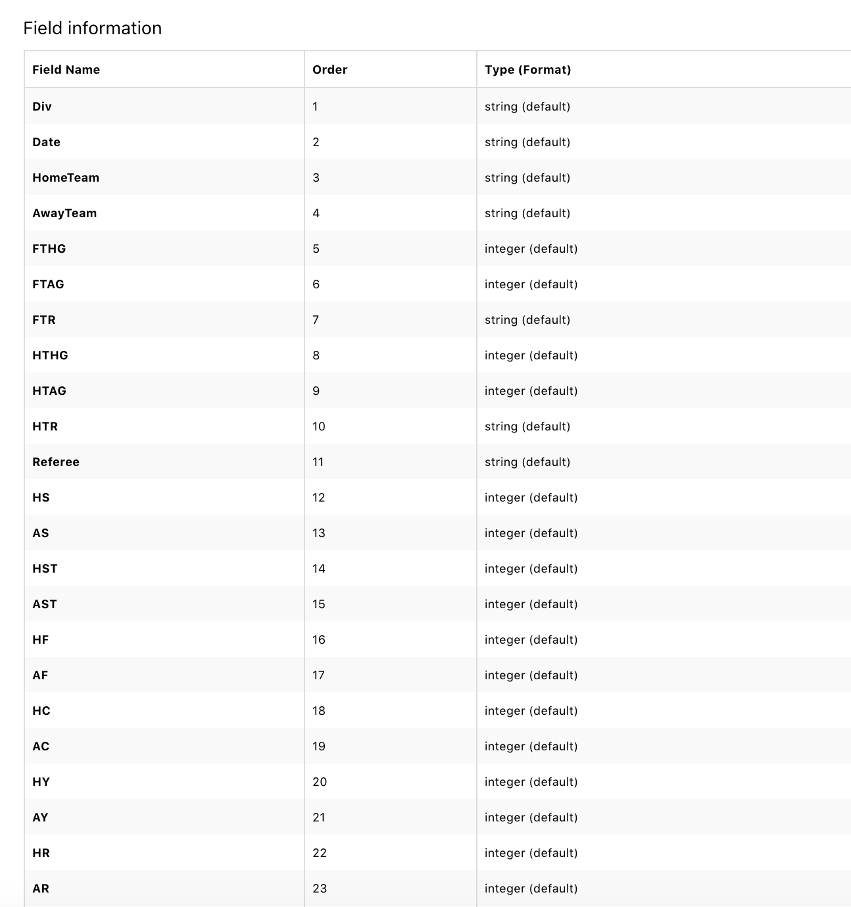

# EPL-Prediction-2019
EPL-Prediction-2019 is a mini project of Kathmandu University, Machine Learning COMP-484. This repo contains dataset, trained models, fixtures of EPL season 2018/2019 and IPython Notebook (ipynb) file.

## Team Members:
* [Binaya Kumar Chaudhary](https://binayachaudari.com.np/)
* [Prabish Kayastha](https://github.com/prabishkayastha)
* [Rojan Bade]()
* [Ujwal Lakhaju](https://github.com/ujwalbqcal)

##Dependencies
* scikit-learn
* pandas
* Seaborn
* glob
Install missing dependencies with [pip](https://pip.pypa.io/en/stable/).

## Dataset
The dataset contains data for last 10 seasons of English Premier League including current season. The data is updated on weekly basis via Travis-CI. The dataset is sourced from [DataHub](https://datahub.io/sports-data/english-premier-league) and contains various statistical data such as final and half time result, corners, yellow and red cards etc.

<p align="center">
  
</p>

Dataset Field Information

<p align="center">
  
</p>

## Data Visualization:
The plot below shows the total goals scored data, total shots on target data, total shots data and scoring ratio data distributed among teams. These data will be used in predicting win, loss and draw probability of each team.
These data were visualized using “Seaborn” library in python.

<p align="left">
  
</p>


<p align="center">
  
</p>

<p align="right">
  
</p>

<p align="center">
  
</p>


## Training and Evaluating models
* `Logistic Regression:`

```sh
Training a LogisticRegression using a training set size of 1448. . .
Trained model in 0.0319 seconds
Made predictions in 0.0064 seconds.
0.9932094854208314 0.994475138121547
F1 score and accuracy score for training set: 0.9932 , 0.9945.
Made predictions in 0.0011 seconds.
F1 score and accuracy score for test set: 1.0000 , 1.0000.
```

* `SVC:`

```sh
Training a SVC using a training set size of 1448. . .
Trained model in 0.1619 seconds
Made predictions in 0.0906 seconds.
0.953397350837176 0.9599447513812155
F1 score and accuracy score for training set: 0.9534 , 0.9599.
Made predictions in 0.0038 seconds.
F1 score and accuracy score for test set: 0.7407 , 0.7800.
```

* `KNeighborsClassifier:`

```sh
Training a KNeighborsClassifier using a training set size of 1448. . .
Trained model in 0.0052 seconds
Made predictions in 0.1366 seconds.
0.5075820056855057 0.6477900552486188
F1 score and accuracy score for training set: 0.5076 , 0.6478.
Made predictions in 0.0053 seconds.
F1 score and accuracy score for test set: 0.5156 , 0.6200.
```
